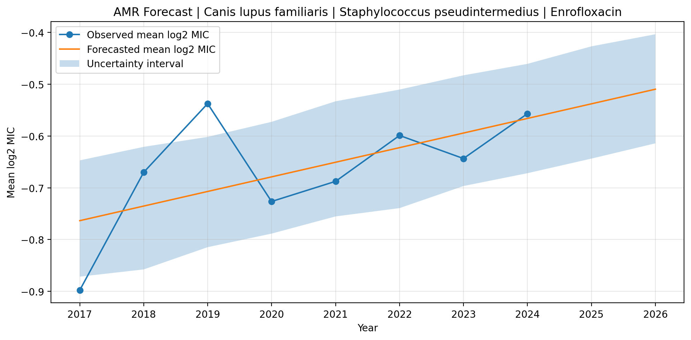
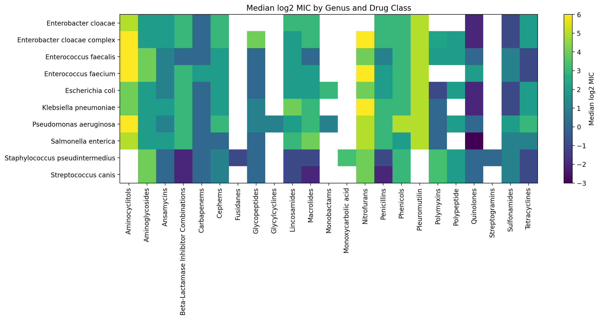

# Privacy Aware Veterinary AMR Forecasting Prototype

<p align="center">
  
  
</p>

<p align="center">
  A research aligned Streamlit prototype for veterinary AMR surveillance, uncertainty aware forecasting, and privacy minded reporting.
</p>

## Overview

This project is a compact research aligned prototype inspired by privacy aware antimicrobial resistance decision support for rural and regional veterinary practice. It uses public veterinary AMR data to combine surveillance analytics, target selection, uncertainty aware forecasting, and traceable export in one workflow.

The purpose of this repository is not to claim a full reproduction of a published research system. The purpose is to show a credible, inspectable, and well structured prototype that reflects the same broader research direction through real data, careful analysis, and responsible reporting.

## Why this project is strong for professor outreach

This prototype is designed to demonstrate four things clearly:

1. It works with real domain data rather than toy examples.

2. It treats decision support as a balance between predictive value and visible caution around uncertainty.

3. It keeps privacy inside the workflow instead of treating it as a final add on.

4. It packages a research aligned idea into a reproducible project that is easy for a professor to inspect.

## Core idea

A useful AMR system should do more than generate a trend line. It should also:

1. show what the data looks like before forecasting,

2. explain how much support exists for a selected target,

3. display uncertainty rather than pretending full confidence,

4. keep reporting and sharing privacy minded.

This prototype is built around that idea.

## What the app does

The Streamlit application performs the following steps:

1. Loads the Vet LIRN AMR Excel workbook.

2. Cleans and standardizes the records.

3. Builds isolate level and yearly trend tables.

4. Creates surveillance outputs for host species, bacterial genera, yearly isolate activity, and MIC patterns across drug classes.

5. Ranks host, pathogen, and drug combinations to identify an informative forecasting target.

6. Forecasts the selected AMR related trend with Prophet.

7. Displays the forecast together with an uncertainty interval.

8. Generates a professor facing project brief.

9. Generates a traceable report package with a recipient specific tag and report ID.

## Research alignment

This prototype aligns with three important ideas:

1. practical AMR decision support built on real surveillance data,

2. careful use of prediction with explicit uncertainty,

3. privacy aware reporting and sharing.

That is why this project is useful for research oriented outreach instead of being just another dashboard.

## Repository structure

```text
Privacy_Aware_Veterinary_AMR_Forecasting_Prototype/
├── app.py
├── requirements.txt
├── README.md
├── .gitignore
├── docs/
│   └── project_brief_for_professor.md
└── outputs/
    └── figures/
        ├── top_host_species.png
        ├── top_genera.png
        ├── yearly_isolate_counts.png
        ├── genus_drugclass_heatmap.png
        └── final_demo_forecast.png